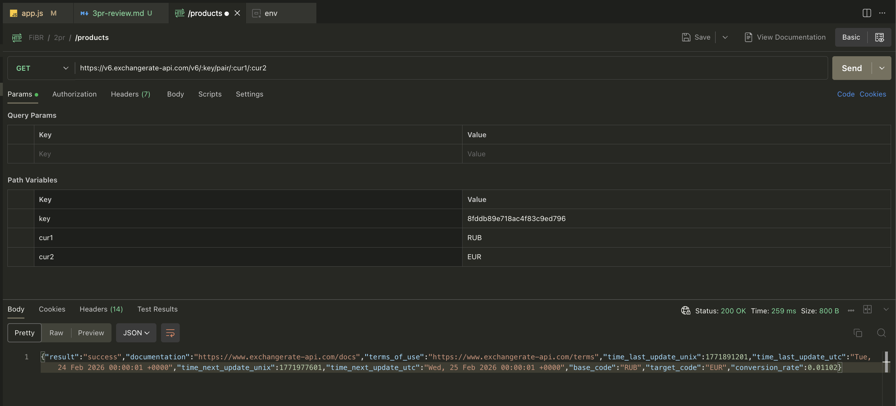

## Тестирование эндпоинтов из ПР2
- `GET: /products` 
- `GET: /products/:id` 
- `DELETE: /products/:id` 

## Запросы на ExchangeRate-API
- Получение данных о валюте (RUB): 
- Запрос на курс между EUR и RUB: 